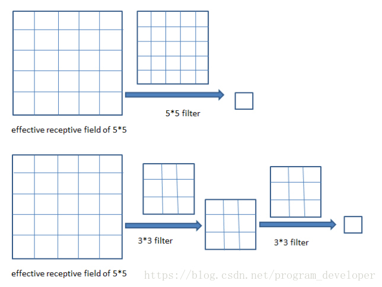

<!-- TOC -->

- [Q&A record](#qa-record)
    - [$1*1$卷积核作用](#11卷积核作用)
        - [改变通道数](#改变通道数)
        - [增加非线性](#增加非线性)
        - [减少参数](#减少参数)
    - [卷积层感受野，小滤波器有效性](#卷积层感受野小滤波器有效性)
    - [RCNN](#rcnn)
        - [Efficient Graph-Based Image Segmentation(基于图的图像分割)](#efficient-graph-based-image-segmentation基于图的图像分割)
        - [Selective Search](#selective-search)
        - [bounding-box regression](#bounding-box-regression)
        - [RCNN](#rcnn-1)

<!-- /TOC -->
# Q&A record

## $1*1$卷积核作用
[[来源]](https://www.cnblogs.com/CZiFan/p/9490565.html)
>假设当前输入张量维度为$6×6×32$，卷积核维度为$1×1×32$，取输入张量的某一个位置（如图黄色区域）与卷积核进行运算。实际上可以看到，如果把$1×1×32$卷积核看成是32个权重$W$，输入张量运算的$1×1×32$部分为输入$x$，那么每一个卷积操作相当于一个$Wx$过程，多个卷积核就是多个神经元，相当于一个全连接网络。
 综上，可以将$1×1$卷积过程看成是将输入张量分为一个个输入为$1×1×32$的$x$，他们共享卷积核变量$W$的“局部”全连接网络（但全连接网络每个参数都是独立的，因此$1×1$卷积参数量要少于等长的全连接网络）。并且$1*1$卷积后往往会经过一个非线性激活函数，增加模型的非线性，这一点是全连接层不具备的。

### 改变通道数
>通过控制卷积核的数量达到通道数大小的放缩。而池化层只能改变高度和宽度，无法改变通道数。
### 增加非线性
>如上所述，1×1卷积核的卷积过程相当于局部全连接层的计算过程，并且还加入了非线性激活函数，从而可以增加网络的非线性，使得网络可以表达更加复杂的特征。
### 减少参数
>在Inception Network中，由于需要进行较多的卷积运算，计算量很大，可以通过引入1×1确保效果的同时减少计算量。具体可以通过下面例子量化比较。
 不引入1×1卷积的卷积操作总共需要的计算量为$（28×28×32）×（5×5×192）≈ 120 million$ (个人认为步长是1的话那个$28*28$应该改成$24*24$)： 

 

>引入1×1卷积的卷积操作: 

 

>总共需要的计算量为$（28×28×16）×（1×1×192）+（28×28×32）×（5×16×16）≈ 12.4 million$ (同样，个人认为步长是1的话那个$28*28$应该改成$24*24$)，明显少于不引入1×1卷积的卷积过程的计算量。其本质我觉得可以理解成，通过1×1卷积操作提取出输入张量的重要特征（相当于降维），然后通过5×5卷积的计算量可以减少很多（减少的比引入1×1卷积所需额外的计算量多多了）。

## 卷积层感受野，小滤波器有效性
[[来源]](https://blog.csdn.net/program_developer/article/details/80958716)
>下面的例子给我们解释了不同卷积核大小带来了同样的感受野效果： 
两层$3*3$的卷积核卷积操作之后的感受野是$5*5$，其中卷积核（filter）的步长（stride）为1、padding为 0： 

 

>三层$3*3$卷积核操作之后的感受野是$7*7$，其中卷积核的步长为1，padding为 0： 

 

>需要特别说明的是多层小滤波器带来的不仅仅是和大滤波器相同的感受野，并且多层的参数量也小于大滤波器一层的。

## RCNN
>[[CNN-Object Detection 视频简明教程来源]](https://www.youtube.com/playlist?list=PL_IHmaMAvkVxdDOBRg2CbcJBq9SY7ZUvs)
### Efficient Graph-Based Image Segmentation(基于图的图像分割)
>[[博客来源1]](https://blog.csdn.net/guoyunfei20/article/details/78727972)[[博客来源2]](https://blog.csdn.net/surgewong/article/details/39008861?utm_medium=distribute.pc_relevant.none-task-blog-BlogCommendFromMachineLearnPai2-2.channel_param&depth_1-utm_source=distribute.pc_relevant.none-task-blog-BlogCommendFromMachineLearnPai2-2.channel_param)
### Selective Search
>[[博客来源]](https://www.cnblogs.com/zyly/p/9259392.html#_labelTop)
其中第三步进行 Selective Search 选择很多目标 bounding-box 后，根据非极大值抑制进一步筛选bounding-box。原文的介绍有待考证。

### bounding-box regression
>[[博客来源]](https://blog.csdn.net/czp_374/article/details/86631910?utm_medium=distribute.pc_relevant.none-task-blog-BlogCommendFromMachineLearnPai2-1.nonecase&depth_1-utm_source=distribute.pc_relevant.none-task-blog-BlogCommendFromMachineLearnPai2-1.nonecase)
### RCNN
>[[简介博客来源]](https://blog.csdn.net/briblue/article/details/82012575) 论文见目录《Rich Feature Hierarchies for Accurate Object Detection and Semantic Segmentation》